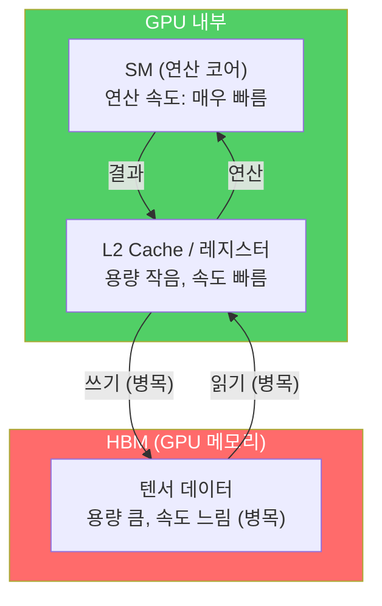
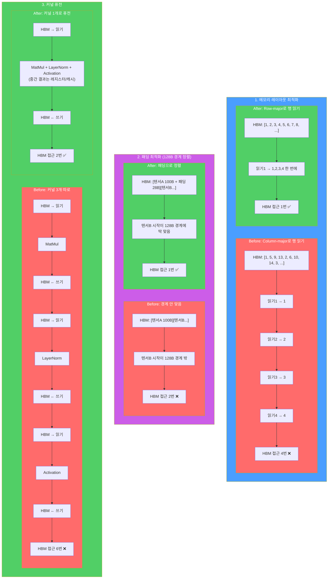

## TensorRT-LLM ##
TensorRT-LLM은 NVIDIA의 범용 딥러닝 추론 엔진인 TensorRT를 LLM에 특화시킨 인퍼런스 프레임워크로, 기존 TensorRT의 커널 퓨전, 메모리 레이아웃 최적화, 패딩 최적화에 더해, LLM 서빙에 필수적인 KV Cache 관리(Paged Attention), Inflight Batching(동적 배칭), Tensor/Pipeline Parallel(멀티 GPU/노드 분산), FP8/INT4 양자화, Speculative Decoding 등을 추가한 것이다. PyTorch 모델을 TensorRT 엔진으로 컴파일해서 GPU 아키텍처별 최적 CUDA 커널을 생성하기 때문에, vLLM 대비 10~30% 높은 성능을 낼 수 있지만 빌드 과정이 복잡하고 NVIDIA GPU에서만 동작한다.

### 연산 최적화 기술 ###
TensorRT은 커널 퓨전, 메모리 레이아웃 최적화, 패딩 최적화를 통해서 L2 캐시에 비해 느린 HBM 메모리 접근 횟수를 줄여 GPU 의 연산을 최적화 한다. 참고로 GPU 는 128 bytes 단위로 메모리 어드레싱 작업을 수행한다. 


### prerequisite ###

기본 설치된 CUDA 12.8용 PyTorch 대신, CUDA 13.0 환경에서 빌드된 PyTorch 2.9.1 버전을 설치한다. PyTorch와 CUDA 런타임 버전을 일치시켜야 드라이버 충돌이나 성능 저하 없이 GPU 연산을 수행할 수 있다.
```bash 
pip3 install torch==2.9.1 torchvision --index-url https://download.pytorch.org/whl/cu130
```
고성능 병렬 계산을 위한 OpenMPI 개발 라이브러리를 설치한다.TensorRT-LLM은 대규모 모델을 여러 개의 GPU에 나누어 처리(모델 병렬화)할 때 GPU 간 통신이 필수적이다. 
```bash
sudo apt-get -y install libopenmpi-dev
```
메시지 큐 라이브러리인 ZeroMQ(ZMQ) 개발 패키지를 설치한다. disagg-serving' (Disaggregated Serving)을 위한 설정으로 
추론 과정 중 '입력값 처리(Prefill)'와 '토큰 생성(Decode)' 단계를 서로 다른 노드/GPU에서 분리해서 처리되는데, 이때 서로 다른 서버(노드) 간에 데이터를 빠르고 안정적으로 주고받기 위해 ZeroMQ라는 통신 엔진이 사용된다.
```bash
# Optional step: Only required for disagg-serving
sudo apt-get -y install libzmq3-dev
```

### TensorRT 엔진 설치 ###
```
pip3 install --ignore-installed pip setuptools wheel && pip3 install tensorrt_llm
```

아래 파이썬 프로그램으로 동작을 테스트한다. 
```python
from tensorrt_llm import LLM, SamplingParams


def main():

    # Model could accept HF model name, a path to local HF model,
    # or Model Optimizer's quantized checkpoints like nvidia/Llama-3.1-8B-Instruct-FP8 on HF.
    llm = LLM(model="TinyLlama/TinyLlama-1.1B-Chat-v1.0")

    # Sample prompts.
    prompts = [
        "Hello, my name is",
        "The capital of France is",
        "The future of AI is",
    ]

    # Create a sampling params.
    sampling_params = SamplingParams(temperature=0.8, top_p=0.95)

    for output in llm.generate(prompts, sampling_params):
        print(
            f"Prompt: {output.prompt!r}, Generated text: {output.outputs[0].text!r}"
        )

    # Got output like
    # Prompt: 'Hello, my name is', Generated text: '\n\nJane Smith. I am a student pursuing my degree in Computer Science at [university]. I enjoy learning new things, especially technology and programming'
    # Prompt: 'The president of the United States is', Generated text: 'likely to nominate a new Supreme Court justice to fill the seat vacated by the death of Antonin Scalia. The Senate should vote to confirm the'
    # Prompt: 'The capital of France is', Generated text: 'Paris.'
    # Prompt: 'The future of AI is', Generated text: 'an exciting time for us. We are constantly researching, developing, and improving our platform to create the most advanced and efficient model available. We are'


if __name__ == '__main__':
    main()
```




